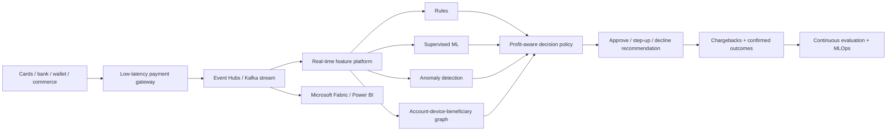

# Real-Time Payment Fraud Detection and Decisioning Platform

## Artificial Intelligence, Machine Learning, Data Science, Cybersecurity, FinTech, Microsoft Fabric, Kafka, MLOps and Graph Analytics

**PaymentShield AI** is an open-source shadow-decisioning benchmark for card and account-to-account payment fraud. It evaluates deterministic rules, behavioral features, graph-linked mule indicators, thresholds, false declines, drift, latency budgets and risk-adjusted payment contribution.

> **Claim boundary:** the included 100,000 transactions and every label, latency, loss and economic value are synthetic. No bank, card network, processor, customer identity or production payment was accessed. The platform never declines, freezes or moves money.

## Business problem

Fraud loss and false declines are competing economic failures. Blocking more payments can reduce fraud while destroying legitimate conversion and customer trust. PaymentShield selects a policy only inside recall and latency constraints, then maximizes modeled contribution after fraud, false-decline, step-up and infrastructure costs.

## Architecture



## Reproduce the shadow benchmark

```bash
pip install -e '.[test]'
pytest -q
paymentshield examples/payment-network/shadow-evaluation.json --output generated/payment-network
```

## Live recommendation API and latency evidence

```bash
paymentshield-api --database ./paymentshield.db --port 8080
paymentshield-benchmark --decisions 10000 --max-p99-ms 10
```

`POST /v1/decisions` is authenticated in production mode, idempotent by transaction ID, detects payload conflicts, persists recommendation receipts and exports Prometheus decision and latency metrics. It remains recommendation-only: it does not connect to an acquirer or execute approve/decline actions.

The benchmark measures only in-process Python decision latency. It explicitly excludes HTTP, TLS, network, feature-store, stream and payment-processor latency, so it is not presented as an end-to-end authorization SLA.

The deterministic fixture generates 100,000 transactions with behavioral, velocity, device, beneficiary, impossible-travel and graph-linked mule signals. Four thresholds compete on:

- fraud recall and precision;
- false-positive rate;
- approval rate;
- fraud loss;
- false-declined payment volume;
- contribution lost to false declines;
- step-up and review cost;
- decision infrastructure cost;
- modeled risk-adjusted contribution;
- latency envelope.

## Graph machine learning and mule-account risk

Shared devices and beneficiaries create coordinated-risk signals that individual transaction scoring misses. The current graph indicator is deterministic and explainable. Graph neural networks remain an evaluation candidate and must beat this baseline before promotion.

## MLOps and drift

Population Stability Index compares baseline and current feature distributions. Material drift requires review; the system never retrains or promotes itself. A production loop would add calibration, temporal validation, fairness testing, delayed-label handling, shadow traffic, canary promotion and rollback.

## Safe degraded operation

- Model outage retains deterministic rules.
- Feature outage routes feature-incomplete or high-risk payments to step-up authentication.
- No automated indefinite account freeze.
- No LLM is permitted on the authorization latency path.
- Agentic AI may investigate and explain cases but cannot move money or make regulated conclusions.

## Azure and Microsoft Fabric path

The target uses API Management, Front Door, Event Hubs, Kafka API, Fabric Real-Time Intelligence, Eventstreams, Eventhouse, OneLake, Azure Machine Learning, Managed Redis, Cosmos DB/PostgreSQL, AKS, Power BI, Application Insights, OpenTelemetry, Sentinel, Entra ID and Key Vault. Included Bicep provisions only a cost-bounded evidence plane, not a payment processor.

## Search and international-role positioning

Broad discovery terms: Artificial Intelligence, Machine Learning, Data Science, Generative AI, Cybersecurity, Cloud Computing, Big Data, Real-Time Analytics, Microsoft Fabric, Power BI, Kubernetes, DevOps, FinTech, Digital Payments and Fraud Detection.

Qualified terms: Payment Fraud Detection, Real-Time Fraud Detection, Transaction Monitoring, Financial Crime, Account Takeover, Scam Prevention, Graph Machine Learning, Anomaly Detection, Feature Store, MLOps, Model Monitoring, Event-Driven Architecture, Apache Kafka, Azure Event Hubs, Explainable AI and Responsible AI.

Exact search-volume figures require Google Keyword Planner, Semrush or Ahrefs and are not invented here. See [search evidence](docs/search-positioning.md).

## Unit-economics integrity

The benchmark separates gross payment volume, false-declined payment volume, contribution lost, fraud loss, review cost and decision infrastructure cost. Recovered payment volume is not counted as profit.

## Production acceptance

This repository is an evaluation harness, not a production fraud service. A live deployment requires authorized data, PCI-scoped architecture, model-risk governance, privacy assessment, resilient feature serving, adversarial testing, temporal validation, human appeal, regulatory mapping and processor-specific certification. See [production readiness](docs/production-readiness.md).

The included Kubernetes StatefulSet is a durable single-writer recommendation service. Multi-replica production serving requires an external low-latency feature store and managed decision ledger; SQLite is not represented as horizontally scalable.

## Work with A2Z SOC

Need to reduce fraud without sacrificing approval rate? **[Request a Real-Time Payment Fraud and Decision Economics Assessment](https://a2zsoc.com)** covering Azure, Fabric, streaming, graph risk, MLOps, resilience and unit economics.
